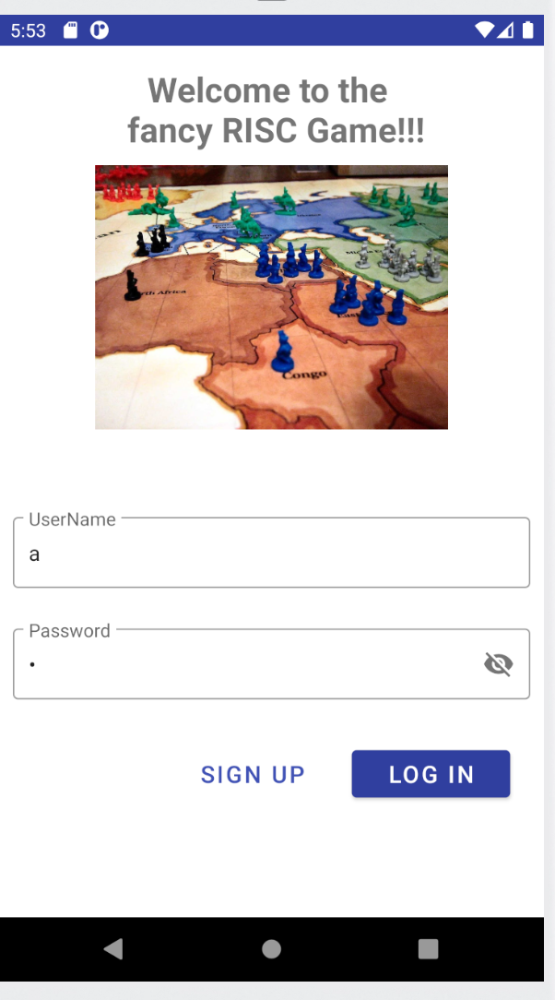
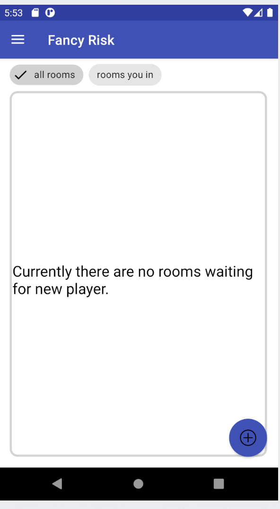
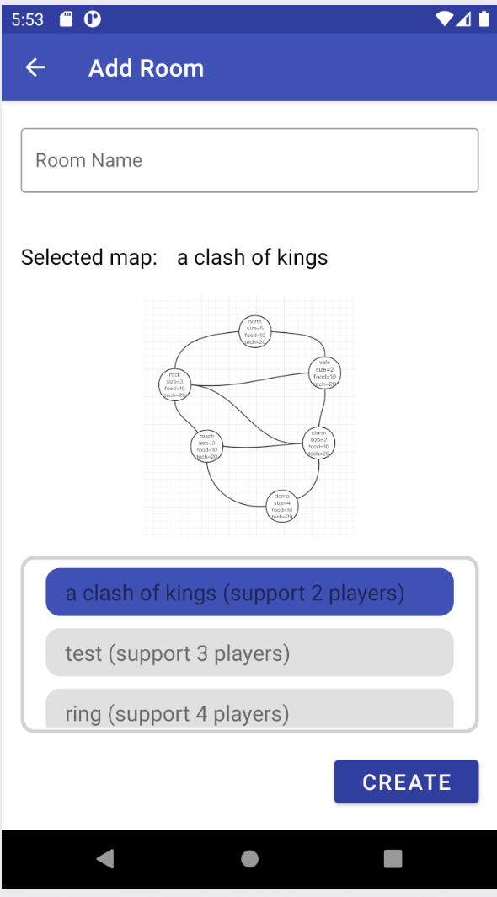
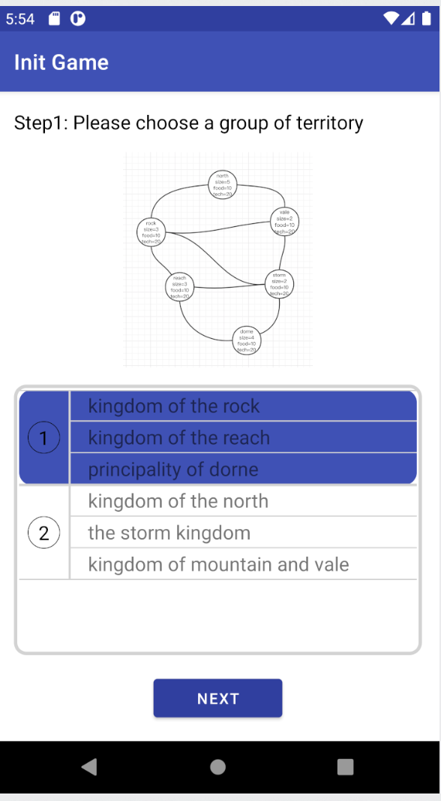
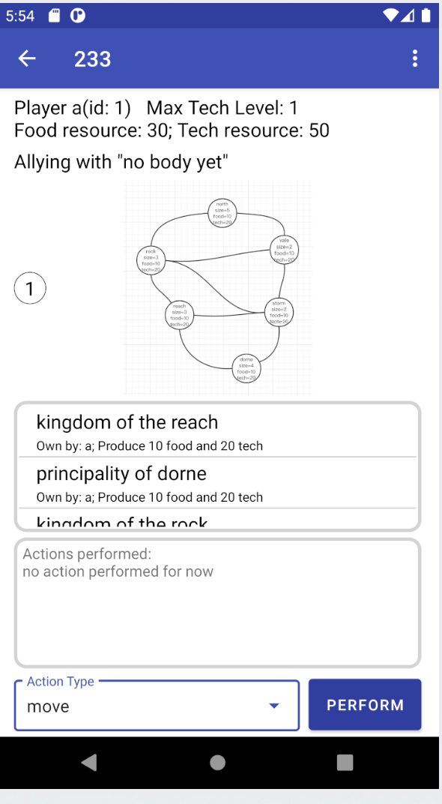
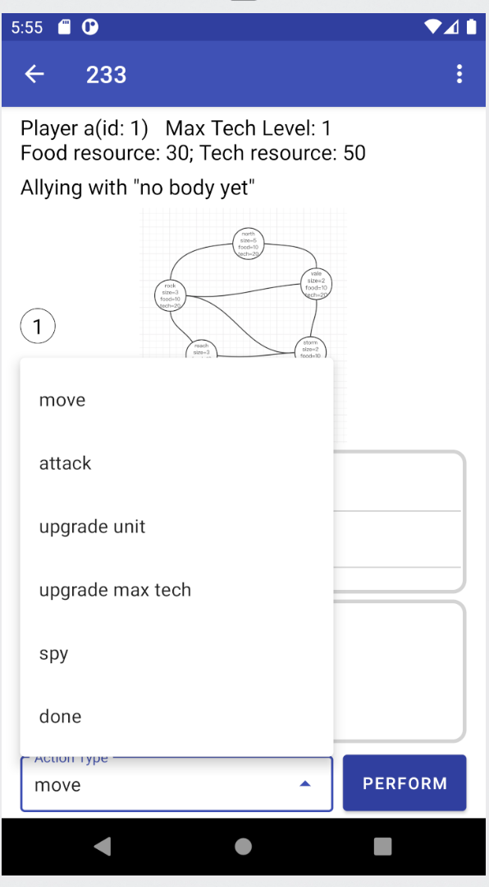

# ece651-spr20-RISC

Android game in Java

grade: 97/100

## prelude

Thanks to my teammate Kewei & Chendga. It is a great journey.

I am responsible for persisting data & recovering.

We use IntelliJ IDEA for editing & debugging

It is much better than Emacs

## video demo for evo.2

[evo.2](https://www.youtube.com/watch?v=VKZ7AIK8RCM)

## preview

login



room view



add room



choose territory



play



action



## UML

[link](https://drive.google.com/file/d/1MILliFXiKYeaP-MawAnwRJEiIybS7V-U/view?usp=sharing)

[evo.2](https://app.creately.com/diagram/YXyNF32eHrc/edit)

## code structure

3 parts:

### frontend

```shell script
RiscClient/app/src/main/java/edu/duke/ece651/riskclient
```

### backend

```shell script
server/src/main/java/edu/duke/ece651/risk/server
```

```shell script
shared/src/main/java/edu/duke/ece651/risk/shared
```

## suggestions

### persist & recover
I use Postgres to store the User name & password

I use MongoDB for storing gaming data, because the data is more like document.

I use Morphia for ODM, and use annotation to store the data. 

db config:
```shell script
server/src/main/java/edu/duke/ece651/risk/server/Mongo.java
```

save & recover
```shell script
server/src/main/java/edu/duke/ece651/risk/server/Room.java
```

save in Room.java mainGame
```java
Mongo m = new Mongo();
m.morCon().save(this);
```

recover in Room.java recover

### Threading strategy 
Server has thread pool to handle the incoming request.

Each room has 1 main thread, and each player thread has its own player thread & its own chat thread.

### synchronization

We use barrier to make sure all info for all thread are up to date

Print out the info can help, but I think setting break point is much better

## run game

My vm may stop working at this moment, and you need to config the MongoDB & Postgres
to make it works.

### client

in 

```shell script
RiscClient/app/src/main/java/edu/duke/ece651/riskclient/Constant.java
```

```java
//local ip for debug, change it to where you run the server
public static final String HOST = "192.168.0.132"; 
public static final int PORT = 12345;
```

change the host
